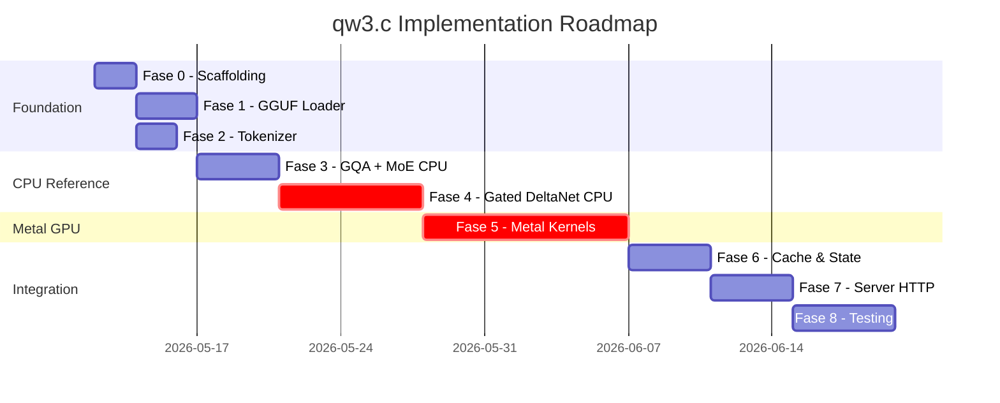

# Piano di Implementazione: qw3.c — Motore di Inferenza per Qwen3.6-35B-A3B

> Seguendo la filosofia minimalista di `ds4.c` di Sanfilippo: **un solo modello, zero framework, codice verticale.**

## Stato Attuale

- Fase 1 completata: loader GGUF, validazione rigida metadata e binding tensor per Qwen3.6-35B-A3B.
- Fase 2 completata: byte-level BPE `qwen35`, prompt ChatML verticale e confronti tokenizer contro `llama.cpp`.
- Fase 3 avviata: primitive CPU reference, dequant `q8_0`/`iq3_s`/`iq4_xs`, session/cache scaffolding e `cpu_moe_layer()` riusabile per MoE top-8 + shared expert.
- MoE allineato al grafo `llama.cpp`: lo shared expert usa anche il router scalare `ffn_gate_inp_shexp` con sigmoid prima della somma col ramo sparse.
- GQA avviata: probe layer 3 con proiezioni Q/K/V `q8_0`, Q/K RMSNorm per-head, RoPE, gate sigmoid, cache K/V a due token e full-attention layer isolato tramite `cpu_full_attention_layer()`.
- DeltaNet CPU avviato: `cpu_deltanet_layer()` autoregressivo per token singolo con short convolution, L2Norm Q/K, update stato, gated RMSNorm, output projection, residual e MoE.
- Session forward CPU collegato end-to-end: embedding → 40 layer ibridi → output norm → `lm_head`; generazione argmax minimale disponibile da CLI. Rimane CPU-reference, non ancora performance path.
- Quantizzazione coperta nel path CPU attuale: `q8_0`, `iq3_s`, `iq4_xs` e `q6_K` per gli expert down incontrati nei layer più alti.
- Chat template allineato a `llama.cpp`: ChatML `<|im_start|>/<|im_end|>` con `<think>`; `--chat-tokenize` coincide con `llama-tokenize` sul prompt di test.
- CLI diagnostica: `--top-k N` stampa i logits dopo prefill; il decode byte-level converte `Ġ`/`Ċ` in spazio/newline per output leggibile.
- Session payload implementato: save/load versionato di tokens, KV cache full-attention, stato DeltaNet, conv state e logits; `--session-roundtrip` verifica il ripristino confrontando i top logits.
- Disk cache CLI minima: `--save-session FILE` salva una sessione prefilledata, `--load-session FILE` la ricarica e continua la generazione dallo stesso stato.
- Trace layer CPU: `--trace-layers` stampa mean/RMS e prime componenti dell'ultimo token di prompt dopo ogni layer, in stile ds4/debug verticale.
- Test vectors locali: `make test-vectors` verifica tokenizzazione ChatML, top logits, continuazione greedy, save/load sessione e roundtrip payload. Sono guardrail provvisori finché non avremo vettori ufficiali o dump reference indipendenti.
- Sampler CPU/CLI: greedy di default (`--temp 0`) più temperature, `--sample-top-k`, `--top-p`, `--min-p` e `--seed` per generazione non-greedy riproducibile.
- Dump fixture CLI: `--dump-logprobs FILE` esporta prompt tokens, token selezionati e top logits per step in JSON compatto, utile per costruire vettori locali e confronti CPU/Metal futuri.
- Separazione backend iniziale: `qw3-cpu` è compilato con `QW3_NO_METAL`, usa CPU come default e rifiuta `--metal` esplicitamente finché il target Metal non viene aggiunto.
- Trace JSON CPU/reference: `--dump-trace FILE` esporta statistiche per embedding, output di ogni layer e top logits finali sul token finale del prompt, preparando il confronto layer-by-layer con i kernel Metal.
- Bring-up Metal avviato e verificato su Apple M5: target `qw3-metal`, bridge `qw3_metal.m/h`, init device/queue e mapping page-aligned del range tensor-data GGUF in 2 viste Metal condivise. I kernel graph non sono ancora collegati.
- Primo kernel Metal diagnostico: `--metal-rmsnorm-test` esegue RMSNorm plain su riga sintetica da 2048 float e confronta con CPU; su Apple M5 passa con `maxdiff=0`.
- Secondo kernel Metal diagnostico: `--metal-embed-test ID` dequantizza una riga embedding `q8_0` direttamente dalla vista Metal del GGUF e confronta con `tensor_read_dense_row()` CPU; token 66 passa con `maxdiff=0`.
- Bring-up Metal full-depth: `--metal-mixed40-test 66` attraversa tutti i 40 layer in modalità first-token e confronta CPU/Metal con `maxdiff=1.335144e-05`, `rmsdiff=1.340667e-06`, `first_bad_layer=-1`.
- Logits Metal first-token: `--metal-logits-test 66` aggiunge `output_norm` e `output.weight` sopra `mixed40`; `output.weight` è `q6_K`, ora supportato anche come matvec 2D. Risultato: top8 CPU/Metal identico, `maxdiff=1.341105e-05`, `rmsdiff=2.278345e-06`, top0 `992`.
- Decode Metal stateful: `--metal-decode-test -p ciao` percorre il prompt ChatML reale tokenizzato (12 token) mantenendo stati DeltaNet e cache KV GQA, poi esegue `output_norm` + `lm_head`. Su Apple M5 passa con top8 CPU/Metal identico, `maxdiff=2.074242e-05`, `rmsdiff=4.185742e-06`, top0 `8160`.
- Continuazione greedy Metal diagnostica: `--metal-greedy-test 2 -p ciao` usa la sessione Metal persistente, confronta CPU/Metal step-by-step e genera token identici (`8160`, `579`), con `maxdiff` circa `2.1e-05`.
- Generazione greedy Metal-only: `--metal-run 2 -p ciao` salta il reference CPU, usa argmax Metal sui logits residenti e mantiene KV GQA + stati DeltaNet/conv persistenti; genera token `8160 579`.
- Integrazione CLI Metal: la generazione one-shot greedy con backend Metal (`./qw3-metal --metal -p ciao -n 2 ...`) ora usa la sessione Metal persistente e produce `Here's` senza reprefill del prompt a ogni token. Rimangono da ottimizzare i readback interni del runner `slow` e da aggiungere sampling non-greedy.
- Sampling CLI Metal: `./qw3-metal --metal -p ciao -n 1 --temp 0.7 --sample-top-k 8 --top-p 0.9 --seed 42` usa la stessa sessione persistente e campiona dai logits sincronizzati (`Here` nel test locale). Il sampling è funzionale, ma temperature/top-k/top-p/min-p non sono ancora implementati interamente GPU-side.
- Ottimizzazione session runner: il residual update ora può salvare `x0 = x0 + attn` su device e la somma del MoE aggiorna `x0` con un kernel dedicato. Questo elimina il readback di `attn` e la ricostruzione CPU `x + attn + moe` per layer nel runner session, lasciando ancora da rimuovere il readback `ffn` usato dal MoE.
- Ottimizzazione DeltaNet session: il runner non legge più `alpha/beta` su CPU per calcolare `sigmoid(beta)` e `gamma`; il kernel recurrent usa `alpha/beta` in scratch più `ssm_dt.bias`/`ssm_a` e calcola direttamente i gate ricorrenti su GPU.
- Ottimizzazione final logits: il path session esegue `output_norm` su `x0` e `lm_head` da `x1` a `logits` dentro i buffer persistenti; rimane il readback finale dei logits per scelta token/sampling.
- Ottimizzazione MoE shared: il ramo shared expert del runner session usa `x1 -> scratch -> inner -> x1 -> x0` su Metal, inclusi `gate/up`, SiLU, down projection e gate scalare `ffn_gate_inp_shexp`. Il ramo sparse top-8 resta ancora CPU-assistito per router/top-k/accumulo.
- Ottimizzazione router MoE: il router sparse `ffn_gate_inp` viene ora calcolato da `x1` dentro la sessione e letto come vettore da 256 score; top-k/softmax ed expert sparse sono ancora CPU-assistiti.
- Ottimizzazione view GGUF: il resolver delle view Metal ora segue la logica di llama.cpp (`tensor_ptr -> view + offs`) invece di usare solo offset globali; questo permette a `lm_head` q8_0/q6_K e alle matvec q8_0 session intermedie di leggere direttamente dalle view Metal del GGUF senza creare copie temporanee del tensor per token.
- Ottimizzazione view GGUF estesa: anche i pesi f32 hot del percorso sessione (`RMSNorm`, router f32, conv DeltaNet, `ssm_dt.bias`/`ssm_a`, gated RMSNorm DeltaNet e Q/K norm GQA) usano le view pointer-based del GGUF invece di `newBufferWithBytes`.
- Ottimizzazione sparse MoE parziale: i wrapper expert IQ3_S/IQ4_XS/Q6_K usati dal ramo sparse leggono ora i pesi expert dalle view GGUF pointer-based invece di copiare l'expert in un buffer temporaneo. Top-k, softmax e accumulo sparse restano ancora lato CPU.
- Ottimizzazione sparse MoE session: il runner session non legge più `ffn` e non costruisce più `moe` su CPU. Dopo il readback dei 256 router score, gate/up IQ3_S, SiLU, down IQ4_XS/Q6_K e accumulo scalato del top-8 sparse avvengono sui buffer persistenti (`x1`/`inner`/`scratch`/`x0`). CPU resta solo per top-k/softmax.
- Ottimizzazione sparse MoE command-buffer: i top-8 expert sparse di un layer vengono encodati in un singolo command buffer Metal, riducendo drasticamente le sincronizzazioni CPU-GPU rispetto a gate/up/SiLU/down/accumulo separati per expert. Misura locale: `--metal-run 8 -p ciao --ctx 128` completa prompt 12 + 8 token in circa `6958 ms`.
- Batching command-buffer stile ds4: `qw3_metal` ora espone `begin/end/synchronize` e le primitive possono usare un command buffer batch non-owned. Il runner session batcha le sezioni tra i readback obbligatori del router e dei logits. Misure locali dopo il cambio: `--metal-run 8 -p ciao --ctx 128` circa `4169 ms`; `--metal-run 32 -p ciao --ctx 256` circa `9035 ms`.
- Dynamic-router sperimentale: `QW3_METAL_DYNAMIC_ROUTER=1` calcola top-8/softmax router su GPU e usa buffer sessione `routerIds/routerWeights` con kernel expert-slot dinamici per il ramo sparse MoE. La correttezza passa su `--metal-session-decode-test -p ciao`, anche quando i tensor expert attraversano due view GGUF grazie a wrapper no-copy per-tensor. Non e' ancora default: il profilo breve peggiora a circa 520-660 ms/token, quindi il prossimo lavoro e' ottimizzarlo o sostituirlo con kernel piu' fusi prima di usarlo nel path normale.
- Ottimizzazioni successive Metal: il buffer costante `iq3_s kgrid` e' ora cached/lazy, e i matvec sparse MoE gate+up IQ3_S sono fusi in un singolo dispatch sia nel path default sia nel ramo dynamic-router. E' stato aggiunto anche `QW3_METAL_GPU_ROUTER_TOPK=1`, che legge dalla GPU solo 8 ids/weights invece dei 256 score router; resta sperimentale perche' nel profilo locale peggiora leggermente il tempo router. Misura default aggiornata: `--metal-run 8 -p ciao --ctx 128` circa `4072 ms`.
- Ottimizzazione Metal stile `llama.cpp`: i kernel hot sparse MoE default ora usano geometria multi-riga per simdgroup (`IQ3_S` gate/up e `IQ4_XS` down/add) invece di un threadgroup per riga; il `lm_head` `Q6_K` usa un kernel row-blocked analogo. Il layer test e `make test-metal-smoke` passano; profilo breve locale: dopo warmup `--metal-run 2 -p ciao --ctx 128` scende tipicamente a ~55-65 ms/token nei token stabili, con `logits_ms` circa 3.5 ms. I path `QW3_METAL_BATCH_MOE=1`, `QW3_METAL_DYNAMIC_ROUTER=1`, `QW3_METAL_GPU_ROUTER_TOPK=1`, Q8 row-blocked e F32 row-blocked sono rimasti sperimentali/non-default perche' piu' lenti o instabili su Apple M5.
- Smoke test Metal: `make test-metal-smoke` copre `--metal-rmsnorm-test`, `--metal-decode-test -p ciao` e la generazione plain `--metal -p ciao -n 2` con output esatto `Here's`. In ambiente Codex va eseguito fuori sandbox/con approvazione per esporre `Apple M5`.
- Session payload su Metal: `--save-session`, `--load-session` e `--session-roundtrip` ora falliscono chiaramente con backend Metal e richiedono `--cpu`, evitando di salvare uno stato CPU sotto una CLI apparentemente Metal. Il supporto payload Metal resta legato alla futura sessione persistente device-side.
- Sessione Metal persistente, scaffold M6: `qw3_metal_session` alloca e azzera buffer device-side per GQA KV, DeltaNet recurrent state, DeltaNet conv state, logits, scratch e buffer intermedi QKV-conv/QNorm/KNorm/core/inner/GQA-token. `--metal-session-test --ctx 128` passa e riporta circa `68.97 MiB` (`gqa_kv=5.00 MiB`, `deltanet=60.00 MiB`, `conv=2.81 MiB`, `logits=0.95 MiB`). Il decode principale usa ora questa sessione; prossimo passo: rimuovere i readback interni rimasti nel runner `slow`.
- Primo kernel su session buffer persistente: `--metal-session-embed-test 66` dequantizza `token_embd` `q8_0` direttamente in `qw3_metal_session.x0`, poi fa readback diagnostico e confronta con CPU; passa con `maxdiff=0`, `rmsdiff=0`.
- Primo mini-chain su session buffer persistenti: `--metal-session-rmsnorm-test 66` esegue embedding in `x0` e layer-0 `attn_norm` in `x1`, con readback diagnostico da `x1`; passa con `maxdiff=9.536743e-07`, `rmsdiff=4.622851e-08`.
- Proiezione QKV su session buffer persistenti: `--metal-session-qkv-test 66` continua il chain `x0 -> x1 -> scratch`, eseguendo `blk.0.attn_qkv.weight` `q8_0` da `x1` a `scratch`; passa con `maxdiff=7.629395e-06`, `rmsdiff=2.907507e-07`.
- Proiezione Z/gate su session buffer persistenti: `--metal-session-z-test 66` scrive `blk.0.attn_gate.weight` `q8_0` da `x1` nello stesso scratch buffer dopo QKV (`scratch_offset=8192`); passa con `maxdiff=2.861023e-06`, `rmsdiff=3.368395e-07`.
- Conv1d DeltaNet su session buffer persistenti: `--metal-session-conv-test 66` continua il chain `x0 -> x1 -> scratch` e scrive la zero-state conv1d di layer 0 nel buffer persistente `qkvConv`; passa con `maxdiff=1.907349e-06`, `rmsdiff=4.746551e-08`.
- L2Norm Q/K su session buffer persistenti: `--metal-session-l2norm-test 66` continua da `qkvConv` e scrive Q/K normalizzati nei buffer persistenti `qNorm`/`kNorm`; passa con `maxdiff=1.490116e-07`, `rmsdiff=1.22139e-08`.
- Gate SSM su session buffer persistenti: `--metal-session-gates-test 66` esegue le proiezioni f32 `ssm_alpha`/`ssm_beta` da `x1` dentro scratch; passa con `maxdiff=1.907349e-06`, `rmsdiff=3.371246e-07`.
- Recurrent zero DeltaNet su session buffer persistenti: `--metal-session-recur-zero-test 66` usa `qNorm`/`kNorm`, V da `qkvConv` e beta sigmoid CPU-diagnostic per scrivere stato DeltaNet e core nei buffer persistenti; passa con `core_maxdiff=5.960464e-08`, `state_maxdiff=1.192093e-06`.
- Gated RMSNorm DeltaNet su session buffer persistenti: `--metal-session-gated-rmsnorm-test 66` continua dal core persistente e dallo Z in scratch verso `inner`; passa con `maxdiff=3.576279e-07`, `rmsdiff=6.08929e-09`.
- Output DeltaNet su session buffer persistenti: `--metal-session-attn-out-test 66` esegue `inner -> blk.0.ssm_out -> x1` senza readback intermedi obbligatori; passa con `maxdiff=3.72529e-08`, `rmsdiff=2.670888e-09`.
- Proiezione GQA su session buffer persistenti: `--metal-session-gqa-project-test 66` esegue layer 3 `attn_q/k/v`, Q/K RMSNorm per-head, RoPE e scrittura K/V cache persistente; passa con `q_max=2.384186e-06`, `k_max=1.192093e-06`, `v_max=4.768372e-07`, `gate_max=1.430511e-06`.
- GQA single-token completo su session buffer persistenti: `--metal-session-gqa-single-test 66` continua da proiezione/cache GQA ed esegue single-token attention più `attn_o -> x1`; passa con `maxdiff=5.960464e-07`, `rmsdiff=9.047454e-08`.
- GQA multi-token da cache persistente: `--metal-session-gqa-cached2-test 66` scrive due token nella KV cache di layer 3 e fa attention del secondo su `n_ctx=2` più `attn_o`; passa con `maxdiff=1.072884e-06`, `rmsdiff=1.063856e-07`.
- Layer completo Metal: `--metal-moe-real-layer-test 66` copre residual, `ffn_norm`, router, top-8 sparse MoE, shared expert e residual finale del layer; passa con `top_match=yes`, `moe_max=2.980232e-07`, `layer_max=9.23872e-07`.
- Runner 40 layer Metal: `--metal-mixed40-test 66` attraversa i layer 0..39 e passa con `maxdiff=1.335144e-05`, `rmsdiff=1.340667e-06`, `first_bad_layer=-1`.
- Final norm + lm_head Metal: `--metal-logits-test 66` aggiunge `output_norm` e `lm_head`; top8 CPU/Metal identico, `maxdiff=1.341105e-05`, `rmsdiff=2.278345e-06`, top0 `992`.
- Nota layout GGUF Qwen3.5-MoE: il codice Hugging Face usa `repeat_interleave` per Q/K rispetto alle V-head, ma `llama.cpp/convert_hf_to_gguf.py` riordina le V-head in layout tiled; nel GGUF il mapping corretto è quindi `hv % num_k_heads`, coerente con `llama.cpp` e con i test vector locali.
- Nota Metal offset alti: i matvec/model-weight wrapper diagnostici ora copiano la slice del tensor dal mmap in un buffer Metal piccolo prima del dispatch. Questo evita letture zero sui tensor collocati nella seconda vista del GGUF; resta un punto da ottimizzare dopo la correttezza.

## Analisi Comparativa delle Architetture

### DeepSeek V4 Flash (ds4.c — esistente)
| Parametro | Valore |
|---|---|
| Layers | 43 |
| Hidden dim | 4096 |
| Vocab | 129280 |
| Heads Q / KV | 64 / 1 (MLA) |
| Experts totali / attivi | 256 / 6 |
| Shared experts | 1 |
| Expert FFN dim | 2048 |
| Attenzione | MLA con compressione KV, indexer, sliding window |
| KV cache | Ultra-compresso (1 head KV, lora-based) |
| Routing speciale | Hash routing (primi 3 layer) + top-k biased |
| HyperConnections | Sì (4 HC per layer) |
| RoPE | YaRN con scaling factor 16 |

### Qwen3.6-35B-A3B (qw3.c — da implementare)
| Parametro | Valore |
|---|---|
| Layers | 40 |
| Hidden dim | 2048 |
| Vocab | 248320 |
| Heads Q / KV (full attn) | 16 / 2 (GQA) |
| Heads Q/K / V (linear attn) | 16 / 32 (Gated DeltaNet) |
| Head dim | 256 (full), 128 (linear) |
| Experts totali / attivi | 256 / 8 |
| Shared experts | 1 (intermediate 512) |
| Expert FFN dim | 512 |
| Layer pattern | 3× linear_attention + 1× full_attention (ripetuto 10×) |
| Attenzione | **Ibrida**: Gated DeltaNet (75%) + GQA standard (25%) |
| RoPE | partial_rotary_factor=0.25, theta=10M |
| Attivazione | SiLU (SwiGLU) |
| Norm | RMSNorm (eps=1e-6) |

---

## Differenze Chiave e Sfide

### 1. Architettura Ibrida Gated DeltaNet + Full Attention
**Questa è la differenza più significativa.** DS4 ha un solo tipo di attention (MLA). Qwen3.6 alterna:
- **30 layer** di Gated DeltaNet (linear attention con stato ricorrente)
- **10 layer** di GQA standard (full quadratic attention)

Il Gated DeltaNet mantiene uno **stato ricorrente** `S ∈ R^{heads × key_dim × value_dim}` che viene aggiornato ad ogni token con un gate di decadimento. Non usa una KV cache tradizionale ma un **state-space model**.

### 2. MoE Più Semplice
- Nessun hash routing — solo **top-8 softmax routing** su tutti i layer
- Nessun bias di routing (`exp_probs_b`)
- Nessuna normalizzazione speciale (`expert_weights_norm/scale`)
- Expert FFN molto piccoli (512 vs 2048) — **il modello è 10× più piccolo**

### 3. Nessuna HyperConnection
- DS4 ha un complesso sistema HC con fn/scale/base per ogni layer
- Qwen3.6 usa connessioni residuali standard

### 4. Nessuna Compressione KV / Indexer
- DS4 ha un sofisticato sistema di compressione KV con ratio-4 e ratio-128
- Qwen3.6: i 10 layer full-attention usano GQA standard (2 KV heads), i 30 layer lineari usano stato ricorrente (nessuna KV cache)

### 5. Dimensioni Ridotte → Possibilità Reali
- **~20GB in IQ4_XS** — gira su MacBook con 32-64GB di RAM
- Expert FFN dim=512 → dispatch MoE molto leggero
- Hidden dim=2048 → matmul più piccole, meno memory-bound

---

## Fattibilità: Verdetto

> [!IMPORTANT]
> **Sì, è fattibile**, ma la sfida principale non è il MoE (che è più semplice di DS4), bensì l'implementazione del **Gated DeltaNet** — un componente che non esiste in ds4.c e richiede kernel Metal dedicati.

Il modello è **significativamente più semplice** di DeepSeek V4 Flash sotto quasi ogni aspetto:
- Niente MLA, niente compressione KV, niente indexer, niente HC
- MoE routing standard (top-k softmax)
- Dimensioni molto più contenute

La complessità unica è il **Gated DeltaNet**, che richiede:
- Un kernel Metal per l'update ricorrente dello stato
- Gestione del "chunked" forward per il prefill (parallelizzabile a chunk)
- Serializzazione/restore dello stato ricorrente per disk cache

---

## Piano di Implementazione in 8 Fasi

### Fase 0: Scaffolding — `qw3.c`, `qw3.h`, `Makefile`
**Durata stimata: 1-2 giorni**

Creare lo scheletro seguendo la struttura ds4:

```
qw3.c          — motore monolitico (GGUF loader, CPU ref, Metal graph)
qw3.h          — API pubblica (engine/session)
qw3_cli.c      — CLI interattiva (riuso linenoise)
qw3_metal.m    — bridge Objective-C per Metal
qw3_metal.h    — header Metal
metal/         — shader .metal
Makefile       — build system
```

**Costanti fisse del modello:**
```c
enum {
    QW3_N_LAYER            = 40,
    QW3_N_EMBD             = 2048,
    QW3_N_VOCAB            = 248320,
    // Full attention (GQA) — layers 3,7,11,...,39
    QW3_N_HEAD             = 16,
    QW3_N_HEAD_KV          = 2,
    QW3_N_HEAD_DIM         = 256,
    // Linear attention (Gated DeltaNet) — layers 0,1,2,4,5,6,...
    QW3_N_LINEAR_Q_HEADS   = 16,
    QW3_N_LINEAR_KV_HEADS  = 16,   // key heads
    QW3_N_LINEAR_V_HEADS   = 32,   // value heads
    QW3_N_LINEAR_HEAD_DIM  = 128,
    QW3_N_LINEAR_CONV_K    = 4,    // short conv kernel
    // MoE
    QW3_N_EXPERT           = 256,
    QW3_N_EXPERT_USED      = 8,
    QW3_N_EXPERT_SHARED    = 1,
    QW3_N_FF_EXP           = 512,
    QW3_N_FF_SHARED        = 512,
    // RoPE
    QW3_ROPE_PARTIAL       = 0.25f,  // solo 25% delle dimensioni
    QW3_ROPE_THETA         = 10000000.0f,
    QW3_RMS_EPS            = 1.0e-6f,
};

// Pattern dei layer (hardcoded, come ds4)
static const bool qw3_layer_is_full_attention[QW3_N_LAYER] = {
    0,0,0,1, 0,0,0,1, 0,0,0,1, 0,0,0,1, 0,0,0,1,
    0,0,0,1, 0,0,0,1, 0,0,0,1, 0,0,0,1, 0,0,0,1,
};
```

---

### Fase 1: GGUF Loader e Weight Binding
**Durata stimata: 2-3 giorni**

Riutilizzare l'infrastruttura GGUF di ds4 (cursor, metadata parser, mmap) con nomi tensor Qwen:

```c
typedef struct {
    // Layer weights — due varianti in base al tipo
    ds4_tensor *attn_norm;

    // === Full Attention (GQA) layers ===
    ds4_tensor *attn_q_proj;      // [hidden, n_head * head_dim]
    ds4_tensor *attn_k_proj;      // [hidden, n_kv_head * head_dim]
    ds4_tensor *attn_v_proj;      // [hidden, n_kv_head * head_dim]
    ds4_tensor *attn_o_proj;      // [n_head * head_dim, hidden]
    ds4_tensor *attn_o_gate;      // output gate weight

    // === Linear Attention (Gated DeltaNet) layers ===
    ds4_tensor *linear_q_proj;
    ds4_tensor *linear_k_proj;
    ds4_tensor *linear_v_proj;
    ds4_tensor *linear_o_proj;
    ds4_tensor *linear_q_gate;    // gating
    ds4_tensor *linear_k_gate;
    ds4_tensor *linear_beta;      // decay parameter
    ds4_tensor *linear_conv_weight; // short convolution [conv_k, hidden]
    ds4_tensor *linear_conv_bias;
    ds4_tensor *linear_o_norm;

    // === MoE FFN (tutti i layer) ===
    ds4_tensor *ffn_norm;
    ds4_tensor *ffn_gate_inp;     // router [hidden, n_expert]
    ds4_tensor *ffn_gate_exps;    // [n_expert, hidden, ff_exp]
    ds4_tensor *ffn_up_exps;
    ds4_tensor *ffn_down_exps;
    ds4_tensor *ffn_gate_shared;  // shared expert
    ds4_tensor *ffn_up_shared;
    ds4_tensor *ffn_down_shared;
} qw3_layer_weights;
```

**Validazione rigida** come ds4: ogni metadata GGUF viene confrontato con le costanti fisse. Se il GGUF non corrisponde, `exit(1)`.

---

### Fase 2: Tokenizer BPE
**Durata stimata: 1-2 giorni**

Qwen usa **byte-level BPE** come DeepSeek. Il tokenizer di ds4 è riutilizzabile quasi interamente:
- Cambia il vocabolario (248320 token)
- Cambia i token speciali (bos=248044, eos=248044)
- Aggiungere token speciali per thinking mode (`<think>`, `</think>`)
- Chat template Qwen (ChatML-style)

```c
void qw3_encode_chat_prompt(
    qw3_engine *e,
    const char *system,
    const char *prompt,
    qw3_think_mode think_mode,
    qw3_tokens *out);
```

---

### Fase 3: CPU Reference Path — Full Attention + MoE
**Durata stimata: 3-4 giorni**

Implementare il path di riferimento CPU per i **10 layer di full attention**:

#### 3a. GQA Standard
Molto più semplice dell'MLA di DS4:
```c
// Per ogni layer full_attention:
// 1. RMSNorm
// 2. Q = x @ W_q  → [n_head, head_dim]
// 3. K = x @ W_k  → [n_kv_head, head_dim]  (GQA: 2 heads)
// 4. V = x @ W_v  → [n_kv_head, head_dim]
// 5. RoPE parziale (solo 25% = 64 dim su 256)
// 6. Standard scaled dot-product attention con KV repeat
// 7. O = concat(heads) @ W_o * gate_sigmoid
// 8. residual += O
```

#### 3b. MoE FFN (uguale per tutti i layer)
```c
// 1. RMSNorm
// 2. Router: logits = x @ W_router → top-8 softmax
// 3. Per ogni expert selezionato:
//    gate = x @ W_gate_i, up = x @ W_up_i
//    mid = silu(gate) * up
//    out_i = mid @ W_down_i
// 4. weighted_sum = Σ(weight_i * out_i)
// 5. shared = silu(x @ W_gate_shared) * (x @ W_up_shared)
//    shared_out = shared @ W_down_shared
//    shared_out *= sigmoid(x @ W_shared_router)
// 6. residual += weighted_sum + shared_out
```

---

### Fase 4: CPU Reference Path — Gated DeltaNet  ⚠️ Fase Critica
**Durata stimata: 5-7 giorni**

Questa è la parte più complessa e **non presente in ds4**.

Stato implementativo: il path autoregressivo a token singolo è presente in CPU reference. La parte ancora aperta è il confronto numerico contro una reference esterna e il prefill chunked; il kernel Metal resta da progettare dopo aver stabilizzato il riferimento CPU.

#### Cos'è il Gated DeltaNet
Un meccanismo di attenzione lineare con stato ricorrente. Per ogni token:

```
# Per ogni head:
q = sigmoid(gate_q) * (x @ W_q)
k = sigmoid(gate_k) * (x @ W_k)
β = sigmoid(linear_beta(x))        # decay/update rate
v = x @ W_v

# Update ricorrente dello stato S:
S_new = S_old - β * (k^T @ (k @ S_old)) + β * (k^T @ v)

# Output:
y = q @ S_new
```

#### Elementi da implementare:
1. **Short convolution** (kernel=4): convoluzione 1D causale prima delle proiezioni
2. **State update**: mantenere `S[layer][head]` come stato ricorrente
3. **Chunked forward**: durante il prefill, processare chunk di token in parallelo con scan ricorrente intra-chunk
4. **State serialization**: per il disk cache

Stato: serializzazione locale implementata per sessione CPU/reference. Il formato è intenzionalmente rigido e valido per stesso modello, stesso binario e stesso `ctx_size`.

```c
typedef struct {
    // Stato ricorrente per i 30 layer lineari
    // S[head][key_dim][value_dim] per ogni layer
    float *deltanet_state;  // [30_layers × heads × k_dim × v_dim]
    // Short conv buffer (ultimi conv_k-1 token)
    float *conv_state;      // [30_layers × hidden × (conv_k-1)]
} qw3_linear_state;
```

> [!WARNING]
> Il Gated DeltaNet è l'unico componente genuinamente nuovo. Tutto il resto è una semplificazione di ds4. Riferimenti implementativi:
> - [fla-org/flash-linear-attention](https://github.com/fla-org/flash-linear-attention) (Triton kernels)
> - [Qwen3.5 modeling code](https://github.com/huggingface/transformers/blob/main/src/transformers/models/qwen3_5_moe/)

---

### Fase 5: Metal Graph — Kernel Shaders
**Durata stimata: 7-10 giorni**

#### 5a. Kernel riutilizzabili da ds4 (con adattamenti dimensionali)
| Kernel ds4 | Uso in qw3 | Modifiche |
|---|---|---|
| `norm.metal` | RMSNorm | Solo cambio eps/dim |
| `dense.metal` | MatMul F16/Q4 | Riutilizzabile |
| `moe.metal` | MoE dispatch | Adattare a 8 experts, FFN dim 512 |
| `flash_attn.metal` | Full attention GQA | Semplificare (niente MLA/compressione) |
| `glu.metal` | SwiGLU | Riutilizzabile |
| `softmax.metal` | Router softmax | Riutilizzabile |
| `get_rows.metal` | Embedding lookup | Riutilizzabile |
| `unary.metal` | Sigmoid, SiLU | Riutilizzabile |

#### 5b. Kernel NUOVI da scrivere
| Kernel | Descrizione | Complessità |
|---|---|---|
| `deltanet_conv1d.metal` | Convoluzione causale 1D (k=4) | Media |
| `deltanet_recurrence.metal` | State update ricorrente | **Alta** |
| `deltanet_chunk_scan.metal` | Prefill parallelo a chunk | **Alta** |
| `rope_partial.metal` | RoPE parziale (25%) | Bassa |
| `gqa_attn.metal` | GQA standard (senza MLA) | Media |

#### 5c. MoE Metal — Semplificazioni
Il kernel `moe.metal` di ds4 (68KB!) è ottimizzato per 256 experts con quantizzazione asimmetrica (IQ2_XXS gate/up + Q2_K down). Per Qwen3.6 con IQ4_XS:
- Expert FFN molto piccoli (512 vs 2048) — un singolo threadgroup può fare un intero expert
- Quantizzazione uniforme IQ4_XS per tutti i pesi expert
- 8 experts attivi (vs 6) ma ciascuno molto più piccolo
- **Il dispatch è più semplice ma con più experts contemporanei**

#### 5d. Piano operativo Metal dettagliato

Questa sezione è il riferimento da usare se il lavoro viene ripreso in una nuova conversazione. L'obiettivo è arrivare a un backend `qw3-metal` completo senza perdere la verificabilità del CPU reference.

**Principio guida:** ogni kernel Metal nasce prima come comando diagnostico isolato, confrontato contro CPU con `maxdiff`/`rmsdiff`; solo dopo entra nel graph end-to-end. Questo segue la filosofia ds4: codice verticale, pochi layer di astrazione, debug vicino al dato reale.

##### Fonti Metal da usare

La struttura del backend Metal segue principalmente `ds4`: bridge C/Objective-C stretto, lifecycle esplicito, graph/session orchestration in C, primitive Metal sottili e diagnostica vicina ai dati. I file `../metal/*.metal` del progetto ds4 sono una base concreta da riusare selettivamente.

La gerarchia di riferimento è:

```text
ds4 ../metal/*.metal     = struttura, stile, primitive già collaudate su Apple Silicon
llama.cpp                = semantica Qwen/GGUF/quantizzazioni quando serve una reference
qw3/qw3_metal.m + metal/ = implementazione finale verticale, specializzata solo Qwen3.6-35B-A3B
```

File ds4 da riusare/adattare presto:

| File ds4 | Uso previsto in qw3 | Note |
|---|---|---|
| `../metal/norm.metal` | RMSNorm plain/weighted, head RMSNorm | Già iniziato con kernel embedded; poi spostare in `qw3/metal/qw3_norm.metal`. |
| `../metal/dense.metal` | matvec/matmul `q8_0`, f16/f32 e pattern dequant | Base per proiezioni Q/K/V/O, shared expert e `lm_head`. |
| `../metal/get_rows.metal` | embedding lookup | Da adattare a embedding `q8_0`; primo test embedded già passa. |
| `../metal/unary.metal` | SiLU, sigmoid, softplus, scale/fill | Utile per DeltaNet gates e MoE. |
| `../metal/glu.metal` | SwiGLU | Utile per shared expert e expert sparse. |
| `../metal/softmax.metal` | router softmax e attention softmax | Da specializzare per top-8 router e GQA. |
| `../metal/argsort.metal` | top-k router | Riusare solo se più semplice di un top-8 dedicato. |
| `../metal/cpy.metal`, `sum_rows.metal`, `repeat.metal`, `concat.metal` | utility graph | Da importare solo quando servono davvero. |

File ds4 da usare come reference ma non copiare alla cieca:

| File ds4 | Motivo |
|---|---|
| `../metal/moe.metal` | DS4 ha expert e quantizzazioni diverse; utile per dispatch/accumulo, ma Qwen richiede top-8, FFN=512, `iq3_s`/`iq4_xs`/`q8_0`. |
| `../metal/flash_attn.metal` | DS4 è legato a MLA/compressione; Qwen usa GQA standard, 16Q/2KV, RoPE parziale. |
| `../metal/dsv4_rope.metal` | Può aiutare per pattern trig/dispatch, ma Qwen richiede RoPE parziale 64/256 e theta 10M. |

File ds4 generalmente da non usare per Qwen:

| File ds4 | Perché |
|---|---|
| `../metal/dsv4_hc.metal` | Qwen non ha HyperConnections. |
| `../metal/dsv4_kv.metal` | Qwen non ha KV compressa/indexer DS4. |
| kernel `dsv4_*` legati a MLA/indexer/compressione | Sono architettura-specifici DS4 e rischiano di confondere il backend Qwen. |

Regola pratica: il codice finale deve vivere in `qw3/metal/qw3_*.metal` o in `qw3_metal.m` finché è piccolo. I file `../metal/*.metal` non devono diventare una dipendenza opaca: si copia/adatta solo il kernel necessario, si rinomina in modo QW3, si semplifica alle dimensioni fisse Qwen e si aggiunge un comando diagnostico CPU-vs-Metal.

##### Stato Metal già raggiunto

- Target `make metal` presente e separato da `qw3-cpu`.
- `qw3-cpu` compila con `QW3_NO_METAL` e rifiuta `--metal`.
- `qw3-metal` compila con Foundation/Metal e include `qw3_metal.m/h`.
- Su Apple M5, fuori sandbox Codex:
  - device rilevato: `Apple M5`;
  - GGUF tensor-data mappato da offset `10.47 MiB`;
  - modello Qwen mappato in `2` viste Metal condivise;
  - `--metal-rmsnorm-test`: RMSNorm plain sintetico `2048` float, `maxdiff=0`;
  - `--metal-rmsnorm-weight-test 66`: RMSNorm con `attn_norm.weight` f32 letto dalla vista GGUF, `maxdiff=9.536743e-07`;
  - `--metal-embed-test 66`: embedding `q8_0` letto/dequantizzato dalla vista GGUF, `maxdiff=0`.
  - `--metal-matvec-q8-test 66`: matvec `blk.0.attn_qkv.weight` q8_0 su embedding+RMSNorm reale, `maxdiff=9.536743e-06`.
  - `--metal-deltanet-proj-test 66`: proiezioni layer0 QKV/Z, RMS Q/K/V/Z allineati al probe CPU, `maxdiff=9.536743e-06`.
  - `--metal-deltanet-conv-test 66`: short conv1d layer0 in zero-state dopo QKV, `maxdiff=2.384186e-06`.
  - `--metal-deltanet-l2-test 66`: L2Norm per-head Q/K post-conv, `maxdiff=1.192093e-07`, norme head0 Q/K uguali a 1.
  - `--metal-deltanet-gates-test 66`: matvec f32 layer0 `linear_ssm_alpha/beta` e trasformazioni gate, `raw_maxdiff=1.907349e-06`, `gate_maxdiff=4.768372e-07`.
  - `--metal-deltanet-recur-zero-test 66`: update ricorrente DeltaNet con stato iniziale zero, scrive `core` e stato `S`, `core_maxdiff=2.980232e-08`, `state_maxdiff=4.768372e-07`.
  - `--metal-deltanet-recur-test 66`: update ricorrente DeltaNet completo con stato non-zero deterministico, decay e `K @ S_old`, `core_maxdiff=5.820766e-10`, `state_maxdiff=1.490116e-08`.
  - `--metal-deltanet-gated-norm-test 66`: gated RMSNorm post-ricorrenza con `linear_ssm_norm` e `SiLU(z)`, `maxdiff=4.768372e-07`.
  - `--metal-deltanet-out-test 66`: projection `linear_ssm_out` q8_0 da `inner` ad `attn`, `maxdiff=4.172325e-07`.
  - `--metal-deltanet-branch-test 66`: branch DeltaNet layer0 composta da embedding/RMSNorm fino ad `attn`, `attn_maxdiff=6.854534e-07`, `state_maxdiff=1.430511e-06`.
  - `--metal-deltanet-resid-norm-test 66`: residual `x + attn` più `ffn_norm.weight`, `maxdiff=4.768372e-07`.
  - `--metal-deltanet-conv-step-test 66`: conv1d layer0 con stato precedente non-zero e stato shiftato in output, `conv_max=4.768372e-07`, `state_max=0`.
  - `--metal-deltanet-recur-step-test 66`: catena conv-step non-zero + L2Norm + recurrence non-zero, `core_max=2.980232e-08`, `state_max=4.768372e-07`.
  - `--metal-deltanet-branch-step-test 66`: ramo attention DeltaNet stateful fino ad `attn` (`conv_step` + recurrence + gated RMSNorm + `linear_ssm_out`), `attn_max=1.072884e-06`, `state_max=4.768372e-07`.
  - `--metal-deltanet-layer-step-test 66`: layer0 DeltaNet stateful completo fino a `x + attn + moe`, top0 `8`, `layer_max=1.192093e-06`, `state_max=1.430511e-06`.
  - `--metal-deltanet-layer2-test 66`: layer0 DeltaNet stateful su due token consecutivi `66,67`, conv/recurrent state portati tra step, top0 finale `38`, `layer_max=1.311302e-06`, `state_max=5.483627e-06`.
  - `--metal-deltanet-layer4-test 66`: layer0 DeltaNet stateful su quattro token consecutivi `66..69`, conv/recurrent state portati tra step, top0 finale `38`, `layer_max=3.874302e-07`, `state_max=3.814697e-06`.
  - `--metal-deltanet-layer8-test 66`: layer0 DeltaNet stateful su otto token consecutivi `66..73`, conv/recurrent state portati tra step, top0 finale `38`, `layer_max=4.768372e-07`, `state_max=1.907349e-06`, `conv_state_max=7.629395e-06`.
  - `--metal-moe-router-test 66`: router MoE f32 da `ffn_in`, top-8 identico, `maxdiff=9.536743e-07`.
  - `--metal-moe-shared-test 66`: shared expert q8_0 completo (`gate/up/down` + `ffn_gate_inp_shexp`), `maxdiff=5.960464e-08`.
  - `--metal-moe-iq4-down-test 66`: `IQ4_XS` down matvec del primo expert sparse, alimentata da hidden CPU `IQ3_S`, `maxdiff=3.72529e-09`.
  - `--metal-moe-iq3-test 66`: `IQ3_S` gate/up del primo expert sparse, `gate_max=4.768372e-07`, `up_max=6.556511e-07`.
  - `--metal-moe-sparse-top1-test 66`: path sparse top-1 completo (`IQ3_S` gate/up + SiLU + `IQ4_XS` down), `maxdiff=1.583248e-08`.
  - `--metal-moe-sparse-top8-test 66`: path sparse top-8 pesato con kernel expert Metal verificati, `maxdiff=1.210719e-08`.
  - `--metal-moe-layer-test 66`: MoE sparse top-8 + shared expert su `ffn_norm(embedding)`, `maxdiff=5.960464e-08`.
  - `--metal-moe-real-layer-test 66`: DeltaNet layer0 + `ffn_norm` post-attn + router/top-8 Metal + MoE sparse/shared + output `x + attn + moe`, top-8 identico, `moe_max=2.980232e-07`, `layer_max=9.23872e-07`.
  - `--metal-deltanet3-test 66`: sequenza primo-token layer 0,1,2 DeltaNet+MoE con stato ricorrente/conv iniziale zero, `maxdiff=2.384186e-07`.
  - `--metal-mixed4-test 66`: sequenza mista first-token layer 0,1,2 DeltaNet + layer3 GQA completo, `maxdiff=1.788139e-07`, `rmsdiff=1.302884e-08`.
  - `--metal-mixed8-test 66`: sequenza mista first-token layer 0..7, due cicli 3x DeltaNet + 1x GQA in helper `mixed_n`, `maxdiff=1.66893e-06`, `rmsdiff=6.170297e-08`.
  - `--metal-mixed40-test 66`: sequenza mista first-token layer 0..39, tutti i 40 layer, `maxdiff=1.335144e-05`, `rmsdiff=1.340667e-06`, `first_bad_layer=-1`.
  - `--metal-logits-test 66`: `mixed40` + `output_norm` + `lm_head` `q6_K`, top8 CPU/Metal identico, `maxdiff=1.341105e-05`, `rmsdiff=2.278345e-06`.
  - `--metal-decode-test -p ciao`: prompt ChatML reale da 12 token, stati DeltaNet e cache KV GQA mantenuti token-by-token, top8 CPU/Metal identico, `maxdiff=2.074242e-05`, `rmsdiff=4.185742e-06`.
  - `--metal-greedy-test 4 -p ciao`: continuazione greedy diagnostica su prompt crescente; decisioni CPU/Metal identiche (`8160`, `579`, `264`, `7047`) e `maxdiff` per step <= `2.1e-05`.
  - Le righe diagnostiche includono `cpu_ms`, `metal_ms`, `total_ms`; `--metal-greedy-test 1 -p ciao` misura circa `8153 ms` CPU reference e `8585 ms` Metal diagnostico su Apple M5.
  - `--metal-run 1 -p ciao`: prima generazione greedy Metal-only, senza CPU reference; genera token `8160` e misura circa `10194 ms` sul prompt da 12 token.
  - Layout DeltaNet GGUF verificato con `qw3/huggingface` e `../llama.cpp`: HF usa V-head grouped + `repeat_interleave`, ma il converter GGUF riordina le V-head in tiled order, quindi QW3 deve usare `hv % QW3_N_LINEAR_QK_HEADS`.
  - I wrapper Metal per pesi letti ad offset alto usano temporaneamente buffer-copy dal mmap (`newBufferWithBytes`) per evitare zeri sulla seconda vista Metal; ottimizzazione futura: resolver di slice robusto senza copia.
  - `--metal-gqa-project-test 66`: layer3 GQA `q/k/v` q8_0 projection, Q/K RMSNorm per-head e RoPE Metal, `q_max=2.384186e-06`, `k_max=1.192093e-06`.
  - `--metal-gqa-single-test 66`: layer3 GQA single-token attention inner (`V * sigmoid(gate)`) + `attn_o` q8_0 Metal, `inner_max=4.768372e-07`, `out_max=5.960464e-07`.
  - `--metal-gqa-attend2-test 66`: layer3 GQA attention su KV cache a 2 token, con `q.k`, softmax e mix gated dei valori, `maxdiff=2.384186e-07`, `rmsdiff=2.472016e-08`.
  - `--metal-gqa-attend4-test 66`: kernel Metal generico `attend_n` su KV cache a 4 token, `maxdiff=8.34465e-07`, `rmsdiff=4.287693e-08`.
  - `--metal-gqa-branch4-test 66`: layer3 GQA projection/cache/`attend_n`/`attn_o` su token `66..69`, `inner_max=8.940697e-07`, `attn_max=1.192093e-06`.
  - `--metal-gqa-layer4-test 66`: layer3 GQA completo su sequenza `66..69`, residual + `ffn_norm` + router/top-8 + MoE, `maxdiff=9.536743e-07`, `rmsdiff=1.270947e-07`.
  - `--metal-gqa-real-layer-test 66`: layer3 GQA `attn_o` + residual + `ffn_norm` + router/top-8 + MoE sparse/shared, top-8 identico, `moe_max=3.576279e-07`, `layer_max=5.960464e-07`.
- CPU reference e test vectors restano il riferimento:
  - `make test-vectors`;
  - `--dump-trace FILE`;
  - `--dump-logprobs FILE`.

##### Comandi diagnostici correnti

```sh
cd qw3
make
make metal

# CPU baseline
make test-vectors
./qw3-cpu --cpu -m ../../models/Qwen3.6-35B-A3B-UD-IQ4_XS.gguf -p ciao --dump-trace /tmp/qw3-ciao.trace.json --ctx 128

# Metal bring-up su Apple M5, da eseguire fuori sandbox se il device non viene enumerato
make test-metal-smoke
./qw3-metal --metal -m ../../models/Qwen3.6-35B-A3B-UD-IQ4_XS.gguf --inspect --ctx 128
./qw3-metal --metal-session-test -m ../../models/Qwen3.6-35B-A3B-UD-IQ4_XS.gguf --ctx 128
./qw3-metal --metal-session-embed-test 66 -m ../../models/Qwen3.6-35B-A3B-UD-IQ4_XS.gguf --ctx 128
./qw3-metal --metal-session-rmsnorm-test 66 -m ../../models/Qwen3.6-35B-A3B-UD-IQ4_XS.gguf --ctx 128
./qw3-metal --metal-session-qkv-test 66 -m ../../models/Qwen3.6-35B-A3B-UD-IQ4_XS.gguf --ctx 128
./qw3-metal --metal-session-z-test 66 -m ../../models/Qwen3.6-35B-A3B-UD-IQ4_XS.gguf --ctx 128
./qw3-metal --metal-session-conv-test 66 -m ../../models/Qwen3.6-35B-A3B-UD-IQ4_XS.gguf --ctx 128
./qw3-metal --metal-session-l2norm-test 66 -m ../../models/Qwen3.6-35B-A3B-UD-IQ4_XS.gguf --ctx 128
./qw3-metal --metal-session-gates-test 66 -m ../../models/Qwen3.6-35B-A3B-UD-IQ4_XS.gguf --ctx 128
./qw3-metal --metal-session-recur-zero-test 66 -m ../../models/Qwen3.6-35B-A3B-UD-IQ4_XS.gguf --ctx 128
./qw3-metal --metal-session-gated-rmsnorm-test 66 -m ../../models/Qwen3.6-35B-A3B-UD-IQ4_XS.gguf --ctx 128
./qw3-metal --metal-rmsnorm-test -m ../../models/Qwen3.6-35B-A3B-UD-IQ4_XS.gguf --ctx 128
./qw3-metal --metal-rmsnorm-weight-test 66 -m ../../models/Qwen3.6-35B-A3B-UD-IQ4_XS.gguf --ctx 128
./qw3-metal --metal-embed-test 66 -m ../../models/Qwen3.6-35B-A3B-UD-IQ4_XS.gguf --ctx 128
./qw3-metal --metal-matvec-q8-test 66 -m ../../models/Qwen3.6-35B-A3B-UD-IQ4_XS.gguf --ctx 128
./qw3-metal --metal-deltanet-proj-test 66 -m ../../models/Qwen3.6-35B-A3B-UD-IQ4_XS.gguf --ctx 128
./qw3-metal --metal-deltanet-conv-test 66 -m ../../models/Qwen3.6-35B-A3B-UD-IQ4_XS.gguf --ctx 128
./qw3-metal --metal-deltanet-conv-step-test 66 -m ../../models/Qwen3.6-35B-A3B-UD-IQ4_XS.gguf --ctx 128
./qw3-metal --metal-deltanet-l2-test 66 -m ../../models/Qwen3.6-35B-A3B-UD-IQ4_XS.gguf --ctx 128
./qw3-metal --metal-deltanet-gates-test 66 -m ../../models/Qwen3.6-35B-A3B-UD-IQ4_XS.gguf --ctx 128
./qw3-metal --metal-deltanet-recur-zero-test 66 -m ../../models/Qwen3.6-35B-A3B-UD-IQ4_XS.gguf --ctx 128
./qw3-metal --metal-deltanet-recur-test 66 -m ../../models/Qwen3.6-35B-A3B-UD-IQ4_XS.gguf --ctx 128
./qw3-metal --metal-deltanet-recur-step-test 66 -m ../../models/Qwen3.6-35B-A3B-UD-IQ4_XS.gguf --ctx 128
./qw3-metal --metal-deltanet-gated-norm-test 66 -m ../../models/Qwen3.6-35B-A3B-UD-IQ4_XS.gguf --ctx 128
./qw3-metal --metal-deltanet-out-test 66 -m ../../models/Qwen3.6-35B-A3B-UD-IQ4_XS.gguf --ctx 128
./qw3-metal --metal-deltanet-branch-step-test 66 -m ../../models/Qwen3.6-35B-A3B-UD-IQ4_XS.gguf --ctx 128
./qw3-metal --metal-deltanet-layer-step-test 66 -m ../../models/Qwen3.6-35B-A3B-UD-IQ4_XS.gguf --ctx 128
./qw3-metal --metal-deltanet-layer2-test 66 -m ../../models/Qwen3.6-35B-A3B-UD-IQ4_XS.gguf --ctx 128
./qw3-metal --metal-deltanet-layer4-test 66 -m ../../models/Qwen3.6-35B-A3B-UD-IQ4_XS.gguf --ctx 128
./qw3-metal --metal-deltanet-layer8-test 66 -m ../../models/Qwen3.6-35B-A3B-UD-IQ4_XS.gguf --ctx 128
./qw3-metal --metal-deltanet-branch-test 66 -m ../../models/Qwen3.6-35B-A3B-UD-IQ4_XS.gguf --ctx 128
./qw3-metal --metal-deltanet-resid-norm-test 66 -m ../../models/Qwen3.6-35B-A3B-UD-IQ4_XS.gguf --ctx 128
./qw3-metal --metal-moe-router-test 66 -m ../../models/Qwen3.6-35B-A3B-UD-IQ4_XS.gguf --ctx 128
./qw3-metal --metal-moe-shared-test 66 -m ../../models/Qwen3.6-35B-A3B-UD-IQ4_XS.gguf --ctx 128
./qw3-metal --metal-moe-iq4-down-test 66 -m ../../models/Qwen3.6-35B-A3B-UD-IQ4_XS.gguf --ctx 128
./qw3-metal --metal-moe-iq3-test 66 -m ../../models/Qwen3.6-35B-A3B-UD-IQ4_XS.gguf --ctx 128
./qw3-metal --metal-moe-sparse-top1-test 66 -m ../../models/Qwen3.6-35B-A3B-UD-IQ4_XS.gguf --ctx 128
./qw3-metal --metal-moe-sparse-top8-test 66 -m ../../models/Qwen3.6-35B-A3B-UD-IQ4_XS.gguf --ctx 128
./qw3-metal --metal-moe-layer-test 66 -m ../../models/Qwen3.6-35B-A3B-UD-IQ4_XS.gguf --ctx 128
./qw3-metal --metal-moe-real-layer-test 66 -m ../../models/Qwen3.6-35B-A3B-UD-IQ4_XS.gguf --ctx 128
./qw3-metal --metal-deltanet3-test 66 -m ../../models/Qwen3.6-35B-A3B-UD-IQ4_XS.gguf --ctx 128
./qw3-metal --metal-mixed4-test 66 -m ../../models/Qwen3.6-35B-A3B-UD-IQ4_XS.gguf --ctx 128
./qw3-metal --metal-mixed8-test 66 -m ../../models/Qwen3.6-35B-A3B-UD-IQ4_XS.gguf --ctx 128
./qw3-metal --metal-gqa-project-test 66 -m ../../models/Qwen3.6-35B-A3B-UD-IQ4_XS.gguf --ctx 128
./qw3-metal --metal-gqa-single-test 66 -m ../../models/Qwen3.6-35B-A3B-UD-IQ4_XS.gguf --ctx 128
./qw3-metal --metal-gqa-attend2-test 66 -m ../../models/Qwen3.6-35B-A3B-UD-IQ4_XS.gguf --ctx 128
./qw3-metal --metal-gqa-attend4-test 66 -m ../../models/Qwen3.6-35B-A3B-UD-IQ4_XS.gguf --ctx 128
./qw3-metal --metal-gqa-branch4-test 66 -m ../../models/Qwen3.6-35B-A3B-UD-IQ4_XS.gguf --ctx 128
./qw3-metal --metal-gqa-layer4-test 66 -m ../../models/Qwen3.6-35B-A3B-UD-IQ4_XS.gguf --ctx 128
./qw3-metal --metal-gqa-real-layer-test 66 -m ../../models/Qwen3.6-35B-A3B-UD-IQ4_XS.gguf --ctx 128
```

##### Milestone M0 — Bridge e model views

**Stato:** completata.

Responsabilità:
- `qw3_metal_init()`: device, command queue, compilazione pipeline diagnostiche.
- `qw3_metal_set_model_map_range()`: mapping page-aligned del range tensor-data GGUF.
- Vista modello multipla: ogni tensor row deve essere risolvibile dentro una view Metal.
- Fallback device: usare `MTLCreateSystemDefaultDevice()`, poi `MTLCopyAllDevices()`.

Criteri di accettazione:
- `make metal` passa.
- `./qw3-metal --metal ... --inspect` inizializza `Apple M5`.
- Il modello viene mappato senza copiare i pesi.

##### Milestone M1 — Primitive elementari verificate

**Stato:** in corso, primi due kernel completati.

Kernel/diagnostiche:
- `qw3_rmsnorm_plain`: completato, `--metal-rmsnorm-test`, `maxdiff=0`.
- `qw3_rmsnorm_weight_f32`: completato, `--metal-rmsnorm-weight-test 66`, `maxdiff=9.536743e-07`.
- `qw3_embed_q8_0`: completato, `--metal-embed-test 66`, `maxdiff=0`.
- `qw3_matvec_q8_0`: completato su `blk.0.attn_qkv.weight`, `--metal-matvec-q8-test 66`, `maxdiff=9.536743e-06`.
- Layer0 DeltaNet QKV/Z projection diagnostic: completato, `--metal-deltanet-proj-test 66`, Q/K/V/Z RMS uguali al probe CPU.
- Layer0 DeltaNet short conv zero-state diagnostic: completato, `--metal-deltanet-conv-test 66`, `maxdiff=2.384186e-06`.
- Layer0 DeltaNet Q/K L2Norm per-head diagnostic: completato, `--metal-deltanet-l2-test 66`, `maxdiff=1.192093e-07`.
- Layer0 DeltaNet alpha/beta gates diagnostic: completato, `--metal-deltanet-gates-test 66`, `raw_maxdiff=1.907349e-06`, `gate_maxdiff=4.768372e-07`.
- Layer0 DeltaNet recurrence zero-state diagnostic: completato, `--metal-deltanet-recur-zero-test 66`, `core_maxdiff=2.980232e-08`, `state_maxdiff=4.768372e-07`.
- Layer0 DeltaNet recurrence non-zero-state diagnostic: completato, `--metal-deltanet-recur-test 66`, `core_maxdiff=5.820766e-10`, `state_maxdiff=1.490116e-08`.
- Layer0 DeltaNet gated RMSNorm diagnostic: completato, `--metal-deltanet-gated-norm-test 66`, `maxdiff=4.768372e-07`.
- Layer0 DeltaNet `linear_ssm_out` diagnostic: completato, `--metal-deltanet-out-test 66`, `maxdiff=4.172325e-07`.
- Layer0 DeltaNet branch diagnostic composto: completato, `--metal-deltanet-branch-test 66`, `attn_maxdiff=6.854534e-07`, `state_maxdiff=1.430511e-06`.
- Layer0 residual + `ffn_norm` diagnostic: completato, `--metal-deltanet-resid-norm-test 66`, `maxdiff=4.768372e-07`.
- Layer0 MoE router diagnostic: completato, `--metal-moe-router-test 66`, top-8 identico, `maxdiff=9.536743e-07`.
- Layer0 MoE shared expert diagnostic: completato, `--metal-moe-shared-test 66`, `maxdiff=5.960464e-08`.
- Layer0 MoE sparse `IQ4_XS` down diagnostic: completato, `--metal-moe-iq4-down-test 66`, expert top-1 `148`, `maxdiff=3.72529e-09`.
- Layer0 MoE sparse `IQ3_S` gate/up diagnostic: completato, `--metal-moe-iq3-test 66`, expert top-1 `148`, `gate_max=4.768372e-07`, `up_max=6.556511e-07`.
- Layer0 MoE sparse top-1 diagnostic: completato, `--metal-moe-sparse-top1-test 66`, expert top-1 `148`, `maxdiff=1.583248e-08`.
- Layer0 MoE sparse top-8 diagnostic: completato, `--metal-moe-sparse-top8-test 66`, experts `148,19,238,240,0,78,200,116`, `maxdiff=1.210719e-08`.
- Layer0 MoE layer diagnostic su input isolato: completato, `--metal-moe-layer-test 66`, sparse top-8 + shared expert, `maxdiff=5.960464e-08`.
- Layer0 DeltaNet + MoE + output reale diagnostic: completato, `--metal-moe-real-layer-test 66`, experts `8,38,146,161,26,168,94,219`, top-8 identico, `ffn_max=3.814697e-06`, `moe_max=2.980232e-07`, `layer_max=9.23872e-07`.
- Mini-sequenza DeltaNet layer 0..2 diagnostic: completato, `--metal-deltanet3-test 66`, stato zero primo-token, `maxdiff=2.384186e-07`, `rmsdiff=1.182331e-08`.
- Sequenza mista layer 0..3 diagnostic: completato, `--metal-mixed4-test 66`, DeltaNet layer 0..2 + GQA layer3 completo, `maxdiff=1.788139e-07`, `rmsdiff=1.302884e-08`, `last_top0=171`.
- Sequenza mista layer 0..7 diagnostic: completato, `--metal-mixed8-test 66`, due cicli 3x DeltaNet + 1x GQA (`0..7`) in un helper `mixed_n` riusabile, `maxdiff=1.66893e-06`, `rmsdiff=6.170297e-08`, `last_top0=221`.
- Layer3 GQA projection diagnostic: completato, `--metal-gqa-project-test 66`, q/k/v projection q8_0 + Q/K RMSNorm + RoPE, `q_max=2.384186e-06`, `k_max=1.192093e-06`, `v_max=4.768372e-07`.
- Layer3 GQA single-token diagnostic: completato, `--metal-gqa-single-test 66`, attention inner + `attn_o` q8_0, `inner_max=4.768372e-07`, `out_max=5.960464e-07`.
- Layer3 GQA 2-token KV diagnostic: completato, `--metal-gqa-attend2-test 66`, `q.k` + softmax + value mix su token `66,67`, `maxdiff=2.384186e-07`, `rmsdiff=2.472016e-08`.
- Layer3 GQA generic KV diagnostic: completato, `--metal-gqa-attend4-test 66`, kernel `attend_n` su token `66..69`, `maxdiff=8.34465e-07`, `rmsdiff=4.287693e-08`.
- Layer3 GQA branch4 diagnostic: completato, `--metal-gqa-branch4-test 66`, proiezioni q/k/v Metal per 4 token + KV cache + `attend_n` + `attn_o`, `inner_max=8.940697e-07`, `attn_max=1.192093e-06`.
- Layer3 GQA layer4 diagnostic: completato, `--metal-gqa-layer4-test 66`, layer completo per il quarto token della sequenza `66..69`, `maxdiff=9.536743e-07`, `rmsdiff=1.270947e-07`, `top0=4`.
- Layer3 GQA real layer diagnostic: completato, `--metal-gqa-real-layer-test 66`, residual + `ffn_norm` + router/top-8 + MoE sparse/shared, experts `55,191,4,145,171,255,161,192`, top-8 identico, `attn_max=5.960464e-07`, `moe_max=3.576279e-07`, `layer_max=5.960464e-07`.
- Prossimi:
  - Sequenze miste piu lunghe: estendere il diagnostico a blocchi 0..7 e poi al primo ciclo completo di layer full-attention.
  - Unary `silu`, `sigmoid`, `softplus`, `exp clamp`: confronti su vettori sintetici e vettori reali.
  - Softmax/top-k router: confrontare layer0 router top-8 del probe CPU.

Criteri di accettazione:
- Ogni comando diagnostico stampa `ok`, `maxdiff`, `rmsdiff`, prime componenti.
- Tolleranze iniziali:
  - dequant/copy/RMSNorm plain: `maxdiff == 0` o entro `1e-7`;
  - matvec quantizzato: inizialmente `maxdiff <= 1e-4`, poi stringere;
  - softmax/router: top-k identico, pesi entro `1e-5`.

##### Milestone M2 — Proiezioni e MoE singolo layer

Obiettivo: riprodurre `cpu_moe_layer()` per un singolo layer, prima senza graph completo.

Ordine consigliato:
1. `q8_0` shared expert:
   - `ffn_gate_shared`, `ffn_up_shared`, `ffn_down_shared`;
   - `silu(gate) * up`;
   - router shared `ffn_gate_inp_shexp` + sigmoid;
   - confronto con sezione `layer0 shared expert` del probe.
2. Router sparse:
   - matvec `ffn_gate_inp` f32;
   - top-8;
   - softmax dei top-8;
   - confronto token 66: top0 attuale `148`.
3. Expert sparse singolo:
   - iniziare con expert top0;
   - supportare `iq3_s` gate/up e `iq4_xs` down usando CPU reference come oracle.
4. Somma top-8:
   - accumulo weighted sparse + shared;
   - confronto con `cpu_moe_layer()`.

Comando diagnostico desiderato:

```sh
./qw3-metal --metal-moe-layer-test 0 --token 66 -m ../../models/Qwen3.6-35B-A3B-UD-IQ4_XS.gguf --ctx 128
```

Criteri di accettazione:
- top-8 router identico alla CPU;
- `moe total` con `maxdiff` ragionevole e RMS basso;
- nessuna allocazione per expert ripetuta nel loop caldo.

##### Milestone M3 — GQA full-attention layer

Obiettivo: riprodurre `cpu_full_attention_layer()` per layer 3, poi per tutti i full layers.

Ordine consigliato:
1. Proiezioni Q/K/V/O `q8_0`.
2. Q/K RMSNorm per-head con weight f32.
3. RoPE parziale:
   - solo `QW3_ROPE_DIM = 64`;
   - theta `10000000`;
   - confronto con `layer3 rope probe`.
4. KV cache full-attention:
   - layout Metal: `[full_layer][pos][kv_head][head_dim]`;
   - iniziare con decode token singolo;
   - poi prompt breve con due token.
5. Attention GQA:
   - 16 Q heads, 2 KV heads;
   - KV repeat ratio 8;
   - scaled dot-product standard.
6. Output projection + gate sigmoid.

Comando diagnostico desiderato:

```sh
./qw3-metal --metal-gqa-layer-test 3 --token 66 --pos 1 -m ../../models/Qwen3.6-35B-A3B-UD-IQ4_XS.gguf --ctx 128
```

Criteri di accettazione:
- `layer3 gqa projection` vicino alla CPU;
- `rope probe` vicino alla CPU;
- `gqa single-token` e `two-token cache` coerenti;
- `cpu_full_attention_layer()` riprodotto entro tolleranza.

##### Milestone M4 — DeltaNet linear layer

Obiettivo: riprodurre `cpu_deltanet_layer()` per layer 0, poi per tutti i 30 linear layers.

Ordine consigliato:
1. Short causal convolution k=4:
   - stato conv `[linear_layer][tensor_linear_qkv][3]`;
   - test su token singolo e sequenza breve.
2. Proiezione fused Q/K/V `q8_0`:
   - tensor `attn_qkv.weight`;
   - split Q, K, V secondo dimensioni fisse.
3. Gates:
   - `attn_gate.weight` q8_0;
   - `linear_ssm_alpha.weight` e `linear_ssm_beta.weight` f32: completato per layer0 con `--metal-deltanet-gates-test 66`;
   - `ssm_a`, `ssm_dt_bias`;
   - funzioni sigmoid/softplus per ora validate nel diagnostico gates confrontando le trasformazioni lato CPU/Metal-output.
4. L2Norm Q/K.
5. Update ricorrente DeltaNet:
   - stato `S[head][128][128]` in float32;
   - zero-state layer0 completato con `--metal-deltanet-recur-zero-test 66`;
   - stato non-zero con decay e sottrazione `sk = K @ S_old` completato con `--metal-deltanet-recur-test 66`;
   - decode token singolo prima, chunked scan dopo.
6. Gated RMSNorm + output projection `ssm_out`:
   - gated RMSNorm completato con `--metal-deltanet-gated-norm-test 66`;
   - matvec `linear_ssm_out` verso `attn` completato con `--metal-deltanet-out-test 66`.
   - branch composta fino ad `attn` completata con `--metal-deltanet-branch-test 66`.
7. Residual + MoE:
   - residual `x + attn` + `ffn_norm` completato con `--metal-deltanet-resid-norm-test 66`;
   - router MoE f32 e top-8 completato con `--metal-moe-router-test 66`;
   - shared expert path completato con `--metal-moe-shared-test 66`;
   - prossimo: sparse expert path top-1.

Comando diagnostico desiderato:

```sh
./qw3-metal --metal-deltanet-layer-test 0 --token 66 -m ../../models/Qwen3.6-35B-A3B-UD-IQ4_XS.gguf --ctx 128
```

Criteri di accettazione:
- `layer0 deltanet projection` vicino alla CPU;
- gates coerenti con probe CPU;
- stato DeltaNet stabile in float32;
- output layer0 vicino a `cpu_deltanet_layer()`;
- nessun NaN/Inf dopo 40 layer.

##### Milestone M5 — Decode graph end-to-end

Obiettivo: generare il prossimo token con graph Metal per un prompt già prefilledato o per prompt breve.

Ordine consigliato:
1. Graph decode a token singolo:
   - embedding;
   - 40 layer alternando linear/full;
   - output norm;
   - lm_head;
   - top logits.
2. Confronto con CPU:
   - prompt `ciao`, `ctx=128`;
   - top-8 logits identici o vicini;
   - primo token atteso: `Here`, id `8160`.
3. Integrare nel comando:

```sh
./qw3-metal --metal-decode-test -p ciao -m ../../models/Qwen3.6-35B-A3B-UD-IQ4_XS.gguf --ctx 128
```

Criteri di accettazione:
- `--metal-decode-test` stampa top logits e differenze CPU/Metal;
- top1 id `8160`;
- `--dump-trace` CPU resta il riferimento per trovare il primo layer divergente.

##### Milestone M6 — Prefill e sessione Metal

Obiettivo: portare `qw3_session` su Metal senza rompere CPU.

Ordine consigliato:
1. Allocare in `qw3_session` una graph/session Metal opzionale solo per backend Metal.
2. Prefill iniziale sequenziale token-by-token, anche se lento.
3. Salvare KV cache full-attention e stato DeltaNet residenti su device.
4. Implementare `qw3_session_sync()` Metal con common-prefix.
5. Solo dopo: chunked prefill per DeltaNet e batch rows.

Criteri di accettazione:
- `./qw3-metal -p ciao -n 8 --ctx 128` produce lo stesso prefisso della CPU
  (avviato per greedy con reprefill completo; da completare con stato Metal
  persistente);
- `--save-session`/`--load-session` restano corretti o vengono esplicitamente bloccati per Metal finché non supportati;
- nessuna regressione in `make test-vectors`.

##### Milestone M7 — Performance path

Obiettivo: rendere Metal utilizzabile, non solo corretto.

Priorità:
1. Evitare readback intermedi.
2. Tenere activation, KV, DeltaNet state e logits su device.
3. Fondere kernel piccoli dove conviene:
   - RMSNorm + matvec quando possibile;
   - Q/K/V split;
   - SiLU multiply;
   - router top-k + softmax.
4. Chunked prefill:
   - GQA batch per full layers;
   - DeltaNet scan per chunk;
   - fallback sequenziale se il chunked path diverge.
5. Profilare con tempi encode/execute/readback in stile ds4.

Criteri di accettazione:
- decode stabilmente più veloce del CPU reference;
- prefill non deve essere inizialmente ottimale, ma non deve essere patologico;
- memoria totale coerente con stima ~20GB + cache/scratch.

##### File e responsabilità previste

- `qw3_metal.h`: API C stretta per bridge Metal e primitive diagnostiche.
- `qw3_metal.m`: device, queue, pipeline cache, model views, tensor helpers, primitive Metal.
- `qw3.c`: graph/session orchestration, confronti CPU/Metal, integrazione backend.
- `qw3_cli.c`: flag diagnostici e comandi di smoke test.
- `metal/*.metal` o sorgenti embedded temporanee:
  - oggi i kernel diagnostici sono embedded in `qw3_metal.m`;
  - quando crescono oltre poche primitive, spostarli in `qw3/metal/qw3_*.metal`;
  - usare `../metal/*.metal` come sorgente da cui copiare/adattare, non come dipendenza generica.
- `tests/test_vectors.sh`: resta CPU-only per default; i test Metal sono manuali o target separato finché richiedono device fuori sandbox.

##### Regole di sicurezza per il lavoro Metal

- Non sostituire il path CPU finché un comando diagnostico Metal non passa.
- Non introdurre fallback silenziosi: se `--metal` non ha device, fallire chiaramente.
- Ogni kernel nuovo deve avere:
  - input sintetico o input reale dal GGUF;
  - confronto CPU;
  - `maxdiff` e `rmsdiff`;
  - comando README;
  - nota nello Stato Attuale del piano.
- Se una divergenza appare nel full graph:
  1. usare `--dump-trace` CPU;
  2. aggiungere dump Metal dello stesso layer;
  3. confrontare embedding → layer N, non i token generati.

---

### Fase 6: KV Cache e State Management
**Durata stimata: 3-4 giorni**

Il sistema di cache è **fondamentalmente diverso** da ds4:

#### Full Attention layers (10 layer): KV Cache tradizionale
- 2 KV heads × 256 dim × context_len × 10 layers
- **Molto compatto**: ~5MB per 1K token di contesto (in FP16)
- Nessuna compressione necessaria (a differenza di DS4)

#### Linear Attention layers (30 layer): Stato ricorrente
- Lo stato è **a dimensione fissa** indipendentemente dalla lunghezza del contesto
- `30 layers × 32 heads × 128 × 128 × 4 bytes ≈ 60MB` (costante!)
- + conv state: `30 × 2048 × 3 × 4 bytes ≈ 720KB`

#### Disk KV Cache
Formato semplificato rispetto a ds4:
```
QW3 header (magic, version, token count, ...)
u32[token_count] checkpoint token IDs
float[vocab_size] last logits
GQA KV cache state (10 layers × 2 heads × ctx × 256 × 2)
DeltaNet recurrent state (30 layers)
DeltaNet conv state (30 layers)
```

> [!TIP]
> Il fatto che lo stato DeltaNet sia a dimensione fissa è un **enorme vantaggio**: il "KV cache" dei layer lineari non cresce con il contesto. Questo rende il disk cache molto più prevedibile rispetto a ds4.

---

### Fase 7: Server HTTP (OpenAI-compatible)
**Durata stimata: 3-4 giorni**

Riutilizzare massicciamente `ds4_server.c`:
- Socket handling, threading, JSON parsing → copia diretta
- Chat template → adattare a ChatML Qwen
- Tool calling → Qwen usa formato diverso da DSML (JSON function calling nativo)
- Thinking mode → `<think>...</think>` tags
- Prefix caching → stessa logica (SHA1 dei token, common prefix)

**Endpoint:**
- `GET /v1/models`
- `POST /v1/chat/completions` (OpenAI)
- Opzionalmente: `POST /v1/messages` (Anthropic)

---

### Fase 8: Testing e Validazione
**Durata stimata: 3-5 giorni**

1. **Logit vectors**: ottenere logits di riferimento dal modello HuggingFace
2. **CPU vs Metal**: verificare che producano risultati identici
3. **Tokenizer test**: confronto byte-per-byte con `transformers`
4. **Agent testing**: verificare con opencode/Claude Code

---

## Stima Dimensioni Codice

| Componente | LOC stimate | Note |
|---|---|---|
| GGUF loader + weights | ~2000 | Riuso ~60% da ds4 |
| Tokenizer BPE | ~800 | Riuso ~80% da ds4 |
| CPU: GQA attention | ~400 | Molto più semplice di MLA |
| CPU: Gated DeltaNet | ~600 | **Tutto nuovo** |
| CPU: MoE FFN | ~500 | Semplificazione di ds4 |
| CPU: layer pipeline | ~400 | Orchestrazione |
| Metal: graph driver | ~3000 | Riuso struttura da ds4 |
| Metal: shaders nuovi | ~1500 | DeltaNet + GQA |
| Metal: shaders adattati | ~2000 | Riuso ~70% da ds4 |
| Session/state mgmt | ~800 | Più semplice di ds4 |
| CLI | ~1500 | Riuso ~90% da ds4 |
| Server | ~5000 | Riuso ~80% da ds4 |
| **Totale** | **~18500** | vs ~16700 di ds4.c |

---

## Memoria e Performance Stimate

### Memoria (IQ4_XS quantization)
| Componente | Dimensione |
|---|---|
| Pesi modello (IQ4_XS GGUF) | ~18-20 GB |
| GQA KV cache (32K ctx) | ~160 MB |
| DeltaNet state | ~60 MB |
| Scratch buffers | ~200 MB |
| **Totale** | **~20 GB** |

> [!TIP]
> **Gira comodamente su un MacBook con 32GB di RAM!** Questo è il grande vantaggio rispetto a DS4 Flash che richiede 128GB.

### Performance attese (M3 Max, 128GB)
| Metrica | Stima |
|---|---|
| Prefill | 150-300 t/s (meno memory-bound) |
| Generation | 40-60 t/s (expert piccoli, hidden piccolo) |

---

## Rischi e Mitigazioni

| Rischio | Impatto | Mitigazione |
|---|---|---|
| DeltaNet numerical stability | Alto | Usare float32 per lo stato, test vs HF reference |
| Chunked DeltaNet prefill performance | Medio | Iniziare con recurrence sequenziale, ottimizzare dopo |
| GGUF tensor naming per Qwen3.5-MoE | Medio | Verificare naming convention su llama.cpp GGUF converter |
| IQ4_XS kernel Metal per expert piccoli | Basso | Expert dim=512 è piccolo, meno ottimizzazione necessaria |
| Multimodalità (vision) | Basso | **Ignorare inizialmente** — focus solo su text |

---

## Roadmap Temporale



**Tempo totale stimato: 5-7 settimane** (una persona, full-time)

---

## Conclusione

Il progetto è **assolutamente fattibile** e, per molti aspetti, **più semplice** di ds4.c:

1. **MoE**: Routing standard top-k, nessun hash routing, expert piccoli → semplificazione netta
2. **Attention**: GQA standard nei full-attention layers → banale rispetto a MLA
3. **Niente HC, niente compressione KV, niente indexer** → enorme riduzione di complessità
4. **Dimensioni**: 20GB vs 81GB → accessibile su hardware consumer

**L'unica vera sfida** è il Gated DeltaNet, che richiede ~2 settimane di lavoro dedicato tra CPU reference e kernel Metal. Tutto il resto è una semplificazione del lavoro già fatto in ds4.

Il risultato finale sarebbe un motore di inferenza da ~20GB che gira a 40-60 t/s su un MacBook con 32GB di RAM — un rapporto qualità/accessibilità eccezionale per un modello MoE da 35B parametri totali.
